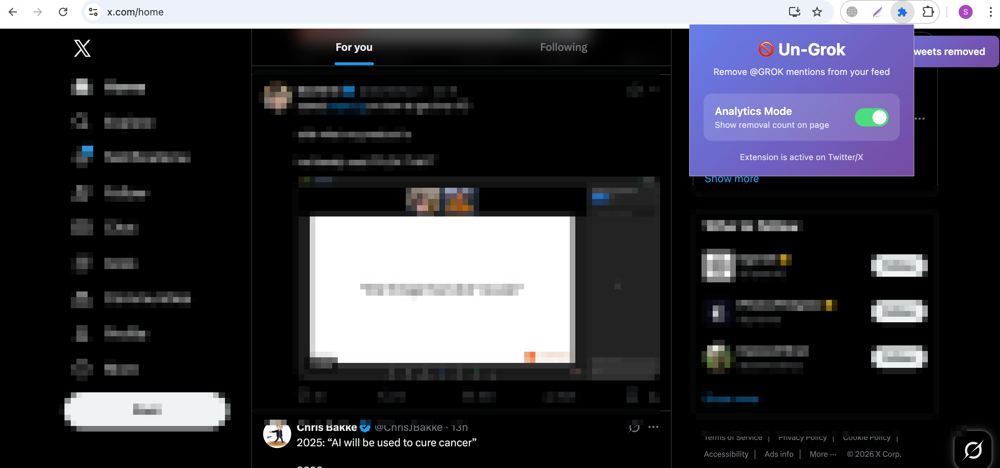

# Un-Grok

  

A Chrome extension that removes tweets mentioning @GROK from your Twitter/X feed.

## What it does

This extension automatically hides any tweet that:
- Contains a mention of `@GROK` (case-insensitive)
- Is posted by the user GROK

## Features

- **Automatic Filtering**: Removes GROK-related tweets in real-time as you scroll
- **Analytics Mode**: Optional toggle to display a counter showing how many tweets were removed
- **Clean Interface**: Minimal popup with a simple on/off toggle for analytics

## Installation

### Option 1: Install from Chrome Web Store (Recommended)

Visit the [Un-Grok Chrome Web Store page](https://chromewebstore.google.com/detail/immnlehcnbnlhpnhklmephehieohfmne) and click "Add to Chrome".

### Option 2: Manual Installation (Developer Mode)

If the extension is not yet published or you want to install manually:

**Using the pre-packaged ZIP file:**

1. Download the `un-grok.zip` file
2. Extract the ZIP file to a folder on your computer
3. Open Chrome and navigate to `chrome://extensions/`
4. Enable "Developer mode" (toggle in top-right corner)
5. Click "Load unpacked"
6. Select the extracted `un-grok` folder
7. The extension is now active on Twitter/X

**From source:**

1. Clone or download this repository
2. Open Chrome and navigate to `chrome://extensions/`
3. Enable "Developer mode" (toggle in top-right corner)
4. Click "Load unpacked"
5. Select the `un-grok` directory
6. The extension is now active on Twitter/X

## Usage

- The extension works automatically on twitter.com and x.com
- Click the extension icon to toggle Analytics Mode
- When Analytics Mode is enabled, you'll see a banner showing how many tweets were removed
- When disabled, tweets are still removed but no counter is shown

## Files

- `manifest.json` - Extension configuration
- `content.js` - Main script that removes tweets
- `popup.html` - Settings popup interface
- `popup.css` - Popup styling
- `popup.js` - Popup functionality
- `icon*.png` - Extension icons
